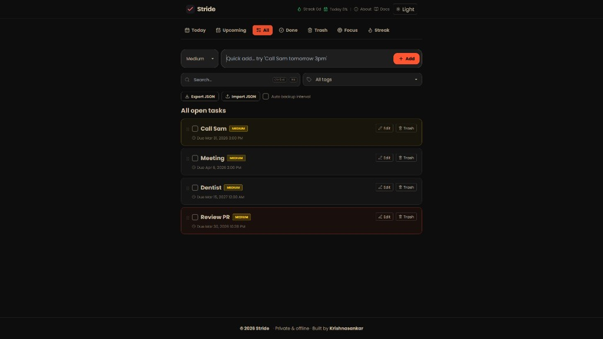

# Stride

**Stride** is a fast, private task list for the browser. Your tasks stay on your device—no account required, offline-capable, and installable as a PWA. Built by [Krishnasankar](https://www.krishnasankar.com).



## What you can do

- **Natural-language quick add** — Try phrases like `Call Sam tomorrow 3pm`; due dates are parsed automatically (via [chrono-node](https://github.com/wanasit/chrono)).
- **Priorities** — Set priority when creating tasks (for example Low / Medium / High).
- **Views** — **Today**, **Upcoming**, **All**, **Done**, **Trash**, **Focus** (Pomodoro-style focus), and **Streak** to stay on track.
- **Search** — Find tasks quickly (keyboard shortcut **Ctrl+K**).
- **Tags** — Organize and filter with tags.
- **Import / export** — Move your data with **Export JSON** and **Import JSON**; optional **auto backup** interval.
- **Themes** — Light and dark modes.
- **Progress cues** — Streak and “today” completion hints in the header.

Live site: [stride.krishnasankar.com](https://stride.krishnasankar.com/) · Source: [github.com/krishnasankarofficial/stride](https://github.com/krishnasankarofficial/stride)

## Tech stack

- [Vue 3](https://vuejs.org/) · [Vite](https://vitejs.dev/) · [Pinia](https://pinia.vuejs.org/) · [Vue Router](https://router.vuejs.org/)
- [Tailwind CSS](https://tailwindcss.com/)
- [vite-plugin-pwa](https://vite-pwa-org.netlify.app/) for offline / installable app support

## Table of contents

- [Installation](#installation)
- [Usage](#usage)
- [Building for production](#building-for-production)
- [Contributing](#contributing)
- [License](#license)
- [Acknowledgements](#acknowledgements)
- [Contact](#contact)

## Installation

1. **Clone the repository**

   ```bash
   git clone https://github.com/krishnasankarofficial/stride.git
   ```

2. **Enter the project directory**

   ```bash
   cd stride
   ```

3. **Install dependencies**

   ```bash
   npm install
   ```

## Usage

Start the dev server:

```bash
npm run dev
```

The app is served at [http://localhost:5173/](http://localhost:5173/) by default.

## Building for production

```bash
npm run build
```

Output is written to the `dist` folder. Preview the production build locally with:

```bash
npm run preview
```

## Contributing

Contributions are welcome.

1. Fork the project  
2. Create a feature branch (`git checkout -b feature/your-feature`)  
3. Commit your changes  
4. Push to the branch and open a pull request  

## License

Distributed under the MIT License. See [`LICENSE`](LICENSE) for details.

## Acknowledgements

- [Vue.js](https://vuejs.org/)
- [Vite](https://vitejs.dev/)
- [Pinia](https://pinia.vuejs.org/)
- [Tailwind CSS](https://tailwindcss.com/)
- [chrono-node](https://github.com/wanasit/chrono) — natural-language dates
- [Lucide](https://lucide.dev/) — icons

## Contact

- **Name:** Krishnasankar K K  
- **Email:** [hello@krishnasankar.com](mailto:hello@krishnasankar.com)  
- **Website:** [www.krishnasankar.com](https://www.krishnasankar.com)  
- **Stride (this app):** [stride.krishnasankar.com](https://stride.krishnasankar.com/)
